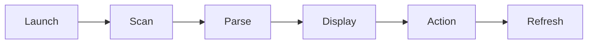

# certificate-manager-editor 🔐✨

  

*A visual home for every certificate on your machine — inspect, import, and manage without touching a single console window.*

  

## 🧭 Overview

certificate-manager-editor started as a weekend itch that never went away. Anyone who's spent an evening squinting at `certutil` output or clicking through five layers of MMC snap-ins knows the pain — Windows certificate stores are powerful, but the tooling around them feels frozen in 2009. This project is our answer: a modern, fast, genuinely pleasant GUI built specifically around the **Certificate Manager** workflow — browsing personal, trusted root, and intermediate stores, inspecting chains, and handling day-to-day PKI housekeeping without memorizing flag syntax.

We built this for the people who live in certificates: sysadmins rolling out internal CAs, developers debugging TLS handshakes on staging boxes, IT teams onboarding code-signing certs, and hobbyists who just want to know why their browser is yelling about an expired root. Whether you're managing a single laptop or auditing certificate stores across a fleet, the goal is the same — turn a cryptic, error-prone task into something you can actually see and reason about.

What keeps this project alive after all these releases is the community treating it like their own toolbox. Every store view, every export dialog, every little keyboard shortcut exists because someone filed an issue saying "this should be easier." That feedback loop is the whole point — a certificate manager GUI should feel like an extension of how you already think about trust, not a fight against the interface.

> [!TIP]
> New here? Skip straight to **Get Started** below — three steps, zero configuration files, no dependency spelunking required.

---

## ⚡ What's Under the Hood

- **Store Explorer** — Browse Personal, Trusted Root, Intermediate CA, and custom logical stores in one unified tree, instead of switching between four separate MMC consoles.

- **Chain Visualizer** — See the full trust chain for any certificate rendered as an actual visual path, from leaf to root, with validity and revocation status color-coded at a glance.

- **One-Click Import/Export** — Drag in `.pfx`, `.cer`, `.p7b`, or `.crt` files and drop them into the correct store without wrestling with password prompts buried three dialogs deep.

- **Expiry Radar** — A dashboard view that surfaces every certificate nearing expiration across all stores, sorted by urgency, so nothing quietly lapses on a production server.

- **Bulk Actions** — Select dozens of certificates and export, delete, or re-categorize them in a single batch operation instead of repeating the same six clicks fifty times.

- **Thumbprint & Fingerprint Copy** — Grab SHA-1/SHA-256 thumbprints instantly with one click, formatted the way scripts and config files actually expect them.

- **Private Key Awareness** — Clearly flags which certificates carry an exportable private key versus which are public-only, so you never guess before an export attempt fails silently.

- **Search That Actually Searches** — Filter by subject, issuer, serial number, or expiry window in real time, across every open store simultaneously.

> [!NOTE]
> Every action in the GUI mirrors what the underlying Windows certificate APIs support — nothing here is a workaround or a shadow store. What you see reflects the real system state.

---

## 🚀 Get Started

| Step | Action |
|------|--------|
| 1️⃣ | Visit the landing page and grab the latest build |
| 2️⃣ | Run the standalone executable — no installer wizard needed |
| 3️⃣ | Let it detect your local certificate stores automatically |
| 4️⃣ | Start browsing, importing, or auditing right away |

> [!IMPORTANT]
> Some store operations (writing to Local Machine stores, importing code-signing certs) require an elevated session. Right-click → **Run as administrator** if you see access-denied prompts.

---

## 🖥️ System Requirements

- Windows 10 (64-bit) or Windows 11

- No .NET runtime installs, no Python, no external dependencies — it's a standalone executable

- ~80 MB of disk space

- Local administrator rights recommended for full store access (not required for read-only browsing)

  

---

## 🛠️ How It Works

The architecture is intentionally simple — a thin, fast GUI layer sitting directly on top of native Windows certificate store APIs, with no background services and no telemetry daemons running behind your back.

1. On launch, the app enumerates all accessible certificate stores for the current user and machine context.

2. Each certificate is parsed for subject, issuer, validity window, key usage, and chain data.

3. Results are cached in memory and rendered into the Store Explorer and Expiry Radar views.

4. Any action you take (import, export, delete, re-categorize) is translated into a direct store API call — immediately, no queued batch jobs.

5. The view refreshes live, so what you see always matches the actual state of the certificate store.

---

## 🧩 Troubleshooting

<strong>The app says "Access Denied" when I try to import a certificate.</strong>

 

You're likely targeting a Local Machine store without elevated privileges. Close the app, right-click the executable, and choose **Run as administrator**.

<strong>A certificate I deleted still shows up after refresh.</strong>

 

Windows sometimes caches store reads briefly. Use the manual refresh button (or `F5`) — if it persists, restart the app to force a clean re-enumeration.

<strong>Why can't I export the private key for a certain certificate?</strong>

 

If the certificate's private key was marked non-exportable at creation time (common with hardware-backed or CA-issued certs), the operating system itself blocks export — this isn't a limitation of the GUI.

<strong>Chain Visualizer shows a broken link even though the cert looks valid.</strong>

 

This usually means an intermediate CA certificate is missing from your store. Import the missing intermediate and the chain should resolve cleanly.

<strong>The Expiry Radar isn't showing a certificate I know is expiring soon.</strong>

 

Check that the store containing it is selected in your active filters — by default the radar only scans stores you've explicitly added to your watchlist.

> [!WARNING]
> Deleting a certificate from the Trusted Root store can break TLS validation for anything relying on it — including system components. Double-check before confirming deletions in that store.

---

## 🎨 UI / UX Details

- **Themes** — Light, Dark, and an auto mode that follows your Windows system theme.

- **Keyboard Shortcuts**:

  | Shortcut | Action |
  |----------|--------|
  | `Ctrl+O` | Import certificate |
  | `Ctrl+E` | Export selected |
  | `Ctrl+F` | Focus search bar |
  | `F5` | Refresh current store |
  | `Del` | Delete selected certificate |
  | `Ctrl+Shift+C` | Copy thumbprint |

- **Settings Panel** — Persist your default export format, preferred hash algorithm for thumbprints, and which stores appear in Expiry Radar by default.

- **Multi-window support** — Pop the Chain Visualizer into its own window for side-by-side comparison across certificates.

---

## 🤝 Contributing & Community

> [!TIP]
> Star the repo if this saved you from another round of `certutil` documentation — it genuinely helps others discover the project.

We welcome issues, feature requests, and pull requests. Whether it's a UI polish, a new store integration, or a troubleshooting doc improvement, open a discussion first if the change is substantial — smaller fixes can go straight to a PR.

- Found a bug? Open an issue with reproduction steps and your Windows build number.

- Have an idea? Start a discussion thread — the roadmap is shaped almost entirely by community input.

- Want to help with docs, translations, or testing? All contributions are welcome, not just code.

---

## 📜 License

Released under the [MIT License](LICENSE), 2026. Use it, fork it, build on it — just keep the license notice intact.

---

## ⚖️ Disclaimer

certificate-manager-editor is provided as-is, without warranty of any kind. Certificate and PKI management can affect system trust and security posture — always verify actions against your organization's policies before applying changes in production environments. This project is community-maintained and is not affiliated with Microsoft.

---

## 📦 Changelog

### v2026.3.0
- Added Expiry Radar dashboard with configurable watchlists

- Improved Chain Visualizer rendering speed for large chains

- Fixed a rare crash when importing malformed `.p7b` bundles

### v2026.2.1
- Introduced dark theme auto-detection based on system settings

- Bulk export now supports mixed certificate types in a single batch

- Patched an issue where thumbprint copy included invisible whitespace

### v2026.1.0
- Initial 2026 release with rebuilt Store Explorer tree view

- Added multi-window support for Chain Visualizer

- Overhauled search to support real-time filtering across open stores